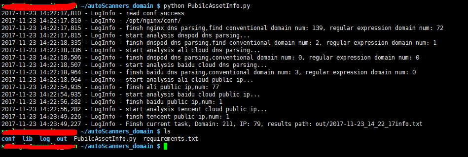

# PubilcAssetInfo 0.1

这个脚本的主要目标是以甲方安全人员的视角，尽可能收集发现企业的域名和服务器公网IP资产。如百度云、阿里云、腾讯云等。

## Author ##

咚咚呛 

如有其他建议，可联系微信280495355

## Support ##

支持获取如下域名服务

	1、nginx(openresty、tengine)配置文件解析
	2、腾讯云 DNSPod域名解析
	3、阿里云 万网域名解析
	4、百度云 BCD域名解析

支持公网IP获取服务

	1、阿里云：支持ECS云主机服务；支持SLB负载均衡服务；支持弹性公网IP服务
	2、百度云：支持弹性公网IP服务；(百度大部分服务都是基于弹性公网来对外提供IP)
	3、腾讯云：支持弹性公网IP服务、CVM云服务器

## Dependencies ##
> sudo pip install -r requirements

## Tree ##

	PubilcAssetInfo
	----conf   #配置目录
	----lib    #模块库文件
	----log    #日志目录
	----out    #输出目录
	----PubilcAssetInfo.py   #主程序
	

## Config ##

配置目录：./conf/info.conf

	#以下相关配置信息不填写则不进行检测

	[Nginx]
	# Nginx 配置文件如 /opt/nginx/conf/nginx.conf
	Nginx_file = 
	# Nginx 配置目录如 /opt/nginx/conf
	Nginx_dir = 
	
	[AliYun]
	# AccessKey需开通AliyunDNSReadOnlyAccess、AliyunSLBReadOnlyAccess、AliyunEIPReadOnlyAccess、AliyunDNSReadOnlyAccess权限
	AliYun_AccessKeyId = 
	AliYun_AccessKeySecret = 
	
	[DNSPod]
	# DNSPOD的用户login_token
	DNSPod_Login_Token = 
	
	[BaiDuYun]
	# 需开工单对客服申请域名服务API权限
	BaiDuYun_AccessKey = 
	BaiDuYun_AccessKeySecret = 
	# 由于百度API/SDK 接口并不支持根域名列表获取，故只能事先填入根域名列表，如
	Baidu_ROOT_Domain_List = graygdd.top,grayddq.top
	
	[Tencent]
	Tencent_SecretId = 
	Tencent_SecretKey = 
	
	[OPTIONS]
	#输出文件，默认不填写为当前目录
	output = 
	#过滤域名，默认不填写则不过滤
	filter_domain = 
	#不填则为域名和公网IP，可选 domain/ip
	type = 
	#日志路径，默认本目录/log/process.log
	log = 
	#各环节结果详情 True/False
	details_info = 

## Log ##

日志目录默认：./conf/info.conf

## Screenshot ##

## DNSPod ##

>DNSPod_Login_Token 是由 ID,Token 组合而成的，用英文的逗号分割
>
>参考：https://support.dnspod.cn/Kb/showarticle/tsid/227/

## Aliyun ##

>AccessKeyId参考：https://help.aliyun.com/document_detail/60884.html
>
>建议开通AliyunDNSReadOnlyAccess、AliyunSLBReadOnlyAccess、AliyunEIPReadOnlyAccess、AliyunDNSReadOnlyAccess权限

## Baiduyun ##

>AccessKey参考：https://cloud.baidu.com/doc/Reference/GetAKSK.html

>需开工单对客服申请域名服务API权限，由于百度API/SDK 接口并不支持跟域名列表获取，故只能事先填入根域名列表

## Tencent ##

>AccessKey生成：云产品->管理工具->云API密钥
